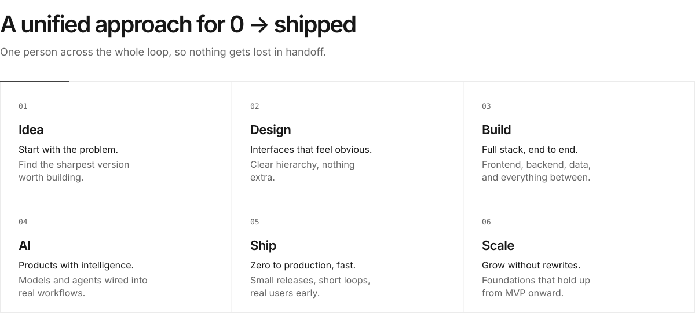

<picture>
  <source media="(prefers-color-scheme: dark)" srcset="./assets/hero-dark.svg" />
  
</picture>

<a href="https://www.linkedin.com/in/william-armstrong8/"><picture><source media="(prefers-color-scheme: dark)" srcset="./assets/btn-linkedin-dark.svg" /></picture></a>&nbsp;&nbsp;<a href="https://github.com/williamarmstrong8?tab=repositories"><picture><source media="(prefers-color-scheme: dark)" srcset="./assets/btn-github-dark.svg" /></picture></a>

   

<picture>
  <source media="(prefers-color-scheme: dark)" srcset="./assets/features-dark.svg" />
  
</picture>

   

<a href="https://www.linkedin.com/in/william-armstrong8/"><picture>
  <source media="(prefers-color-scheme: dark)" srcset="./assets/cta-dark.svg" />
  
</picture></a>

