 

<a href="https://github.com/williamarmstrong8/cue">cue</a> ·
<a href="https://github.com/williamarmstrong8/hearthboard">hearthboard</a> ·
<a href="https://github.com/williamarmstrong8/jarvis-personal-home-agent">jarvis</a> ·
<a href="https://williamarmstrong.vercel.app/startups/club-pack">club pack</a> ·
<a href="https://williamarmstrong.vercel.app/startups/happy-mile">happy mile</a> ·
<a href="https://williamarmstrong.vercel.app/startups/mod-brew">mod brew</a>

  

 

<code><a href="https://williamarmstrong.vercel.app/">portfolio</a></code>&nbsp;
<code><a href="https://www.linkedin.com/in/william-armstrong8/">linkedin</a></code>&nbsp;
<code><a href="https://x.com/armstrongwill8">x</a></code>&nbsp;
<code><a href="https://williamarmstrong.vercel.app/photography">photography</a></code>

